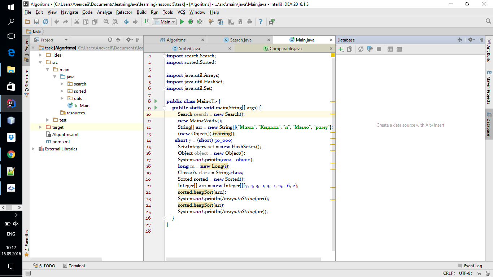
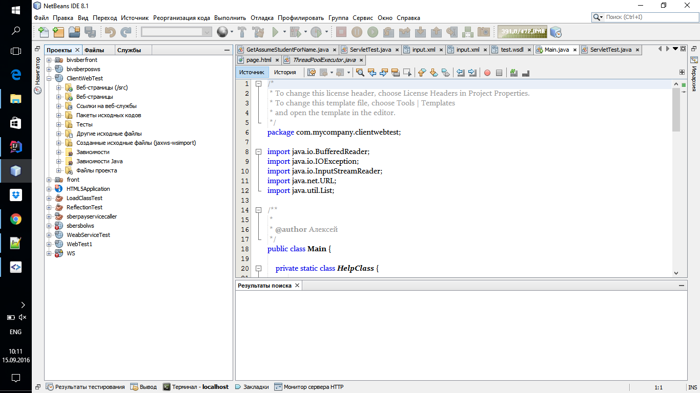

#—равнение интерфейсов сред разработки IDEA и NetBeans

Ќа скриншоте ниже представлен интерфейс хорошего интерфейса (среда разработки IntelliJ IDEA). ¬се можно удобно настроить в найстройка, 
которые расположены в File -> Settings (логично и удобно). —лева видно деро проекта, где представлена вс€
структура проекта, в которой любой разработчик может разобратьс€ и пон€ть где и что находитс€. —права 
расположена окно, которое при не надобности можно скрыть, в нем можно открыть базу данных, удобно работать с
различными сборшиками проектов.

Ќа данном скриншоте представлен пример плохого интефейса (среда разработки NetBeans). —лева представлена иерархи€ проектов, 
где выведена, зачастую, не нужна€ информаци€ (¬ыб-старницы, ¬еб-службы, ƒругие исходные файлы),
все это может запутать человека, а обычное дерево пакетов проекта находитс€ на вкладке файлы (не совсем логично). “ак же
настройки расположены на кладки —ервис -> ѕараметры, при первом использовании поис данного меню может зан€ть много времени.
